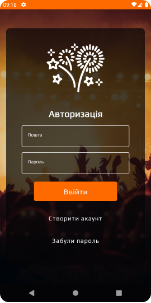
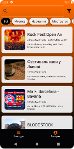
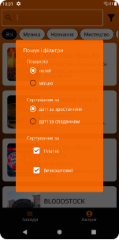
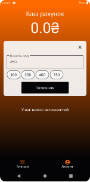
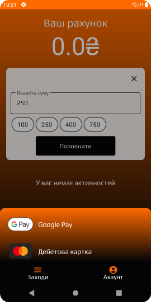
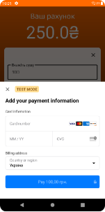
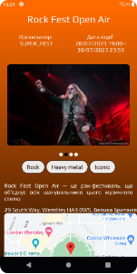
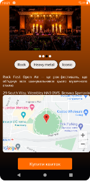
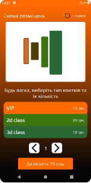
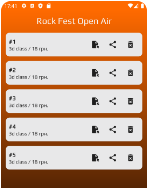

# fServ_app
mobile application for booking tickets to public events

   

    

     

## Features
* registration/authorization, password reset via email
* viewing, searching and sorting of public events
* replenishment of the personal account
* purchase tickets
* opening tickets for viewing/printing, the ability to share tickets in third-party applications

## Technologies
* Kotlin
* Jetpack Compose
* MVVM
* Retrofit
* Gson
* Paging3
* WorkManager
* Stripe / Google Pay
* Coil
* Accompanist
* Navigation
